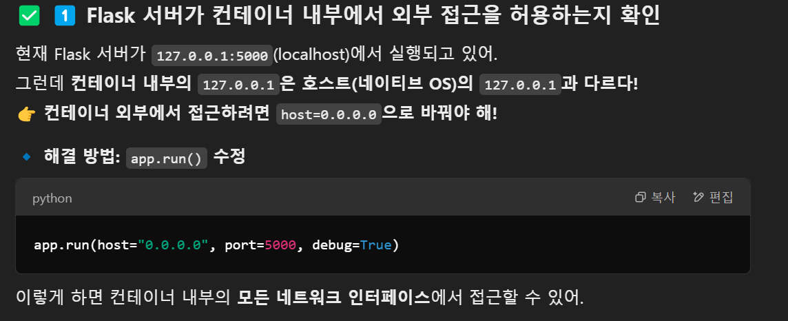

# Crawling Project

## 설치 방법

```bash
git clone <repository-url>
cd my_project
python3 -m venv venv
source venv/bin/activate
pip install -r requirements.txt
```

## 실행 방법

```
  python app.py
```

### 버그 수정

- dockerfile 실행된 뒤에도 flask 접속 안됬던 문제.
  
